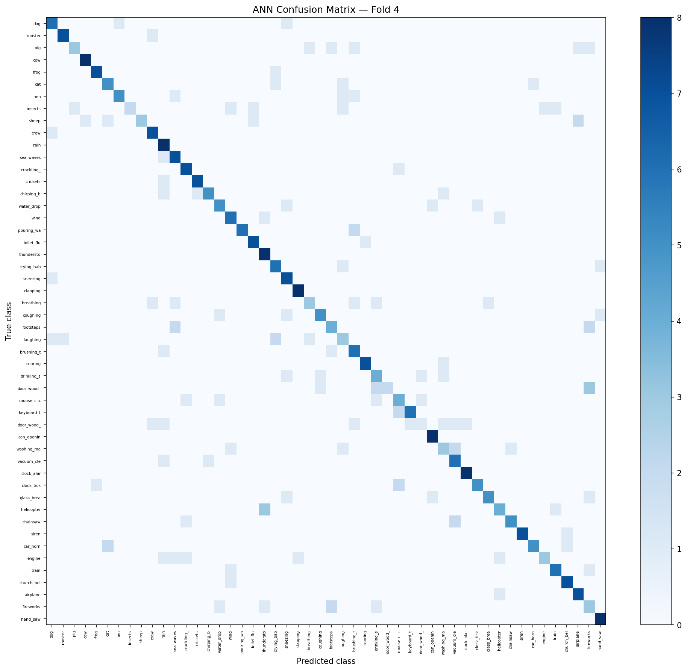

# appendices

reference tables, confusion matrices, SpiNNaker params, reproducibility info. keeping all the detailed numbers here so the main chapters can focus on narrative.

---

## appendix A: full results tables

### A.1 complete per-fold accuracy -- all encodings (5-fold CV)

All use SpikingCNN (622K params), ESC-50 5-fold CV (400 test/fold), Adam (lr=1e-3, wd=1e-4), 50 epochs, early stopping patience=10. ANN identical arch with ReLU. Population uses 500 output neurons (10/class), MSE count loss. All others use CE on summed membrane, T=25. Std is population std.

| Encoding | Fold 1 | Fold 2 | Fold 3 | Fold 4 | Fold 5 | Mean | Std | Gap vs ANN |
|----------|--------|--------|--------|--------|--------|------|-----|-----------|
| ANN (baseline) | 63.25% | 59.50% | 65.25% | 68.75% | 62.50% | 63.85% | 3.07% | -- |
| SNN Direct | 40.50% | 48.50% | 48.25% | 54.00% | 44.50% | 47.15% | 4.50% | -16.70 pp |
| SNN Phase | 22.50% | 22.25% | 25.00% | 24.25% | 26.75% | 24.15% | 1.66% | -39.70 pp |
| SNN Rate | 24.50% | 27.25% | 23.00% | 21.50% | 23.75% | 24.00% | 1.90% | -39.85 pp |
| SNN Population | 22.75% | 18.50% | 15.75% | 22.00% | 16.75% | 19.15% | 2.79% | -44.70 pp |
| SNN Latency | 14.00% | 15.75% | 17.75% | 15.50% | 18.50% | 16.30% | 1.62% | -47.55 pp |
| SNN Delta | 8.25% | 7.75% | 7.25% | 7.50% | 5.50% | 7.25% | 0.94% | -56.60 pp |
| SNN Burst | 5.00% | 5.25% | 9.25% | 6.00% | 7.00% | 6.50% | 1.54% | -57.35 pp |

Source: `results/snn/{encoding}/summary.json` and `results/ann/none/summary.json`.
Direct fold 1 = 40.50% (CSF3 canonical; local MPS retrain was 45.50% -- Decision #23 uses CSF3 value).

### A.2 PANNs transfer learning -- all folds

Frozen CNN14 embeddings (2048-d, AudioSet). SNN head = 3-layer SNN. ANN head = same with ReLU. Linear = logistic regression. 50 epochs, same Adam/scheduler.

| Model | Fold 1 | Fold 2 | Fold 3 | Fold 4 | Fold 5 | Mean | Std |
|-------|--------|--------|--------|--------|--------|------|-----|
| PANNs + SNN | 92.00% | 94.50% | 91.00% | 93.50% | 91.50% | 92.50% | 1.30% |
| PANNs + ANN | 93.00% | 95.00% | 92.00% | 95.50% | 91.75% | 93.45% | 1.54% |
| PANNs + Linear | 94.25% | 95.75% | 92.50% | 95.25% | 91.25% | 93.80% | 1.69% |

Source: `results/panns/panns_snn_head_all_folds_50ep.json`.

### A.3 surrogate gradient ablation (fold 1, seed 42)

Direct encoding, fold 1, single seed. Best validation accuracy reported.

| Surrogate Function | Best Acc. | Best Epoch | Status |
|-------------------|-----------|------------|--------|
| spike_rate_escape | **46.00%** | 50 | Complete |
| fast_sigmoid (slope=25) | 44.75% | 50 | Complete |
| atan (α=2.0) | 35.75% | 49 | Complete |
| ste | 10.25% | 1 | Failed (early stop ep11) |
| sigmoid (slope=25) | 2.00% | 1 | Failed (early stop ep11) |
| triangular | 2.75% | 13 | Failed (early stop ep23) |
| sfs (slope=25) | 2.00% | 1 | Failed (early stop ep10) |
| lso (slope=0.1) | N/A | — | Crashed (Python 3.14/snnTorch 0.9.4 incompatibility) |

*Source: `results/snn/surrogate_ablation/ablation_fold1_seed42.json`.*
*Note: 1-seed result (n=1). Bimodal distribution: learning group {sre, fast_sigmoid, atan} vs failure group {STE, sigmoid, SFS, triangular}.*

### A.4 Adversarial Robustness — Full Table (Fold 4, 400 Samples)

SNN: direct encoding, fold 4 local model (53.75% clean). ANN: fold 4 local model (68.75% clean). Fold 4 models used for all adversarial experiments (consistent with fold 4 usage for SpiNNaker).

| ε | FGSM SNN | FGSM ANN | PGD SNN (40 steps) | PGD ANN (40 steps) |
|---|---------|---------|-------------------|-------------------|
| 0.00 (clean) | 53.75% | 68.75% | 53.75% | 68.75% |
| 0.01 | 37.50% | 22.50% | 23.50% | 14.75% |
| 0.02 | 32.00% | 8.75% | 20.50% | 2.00% |
| 0.05 | 29.00% | 2.50% | 19.25% | 0.00% |
| 0.10 | **26.00%** | **1.75%** | 6.25% | 0.00% |
| 0.20 | 21.50% | 1.25% | 1.25% | 0.00% |
| 0.30 | 20.75% | 0.75% | 1.25% | 0.00% |

*Source: `results/adversarial/robustness_fold4.json`.*
*Note: PGD results may overestimate SNN robustness due to vanishing surrogate gradients (Wang et al. 2025). FGSM results are more reliable.*

### A.5 NeuroBench Energy Analysis (5-Fold Validated)

| Metric | SNN (direct) | ANN |
|--------|-------------|-----|
| Effective ACs/sample | 1,080,000 | 0 |
| Effective MACs/sample | 0 | 101,000 |
| Dense SynOps/sample | 50,688,000 | 101,000 |
| Energy/sample (sim.) | **968 ± 37 nJ** (AC × 0.9 pJ) | **454 ± 11 nJ** (MAC × 4.6 pJ) |
| ActivationSparsity | 74.16% | 59% |
| Model footprint | 2.49 MB | 2.49 MB |
| ConnectionSparsity | 0.00% | 0.00% |

*Source: `results/neurobench/analysis_fold{1-5}.json` (5-fold validated).*
*Energy per AC = 0.9 pJ (8-bit ADD at 45nm CMOS), Energy per MAC = 4.6 pJ (8-bit MAC at 45nm CMOS), per Yik et al. 2025 NeuroBench defaults.*

### A.6 SpiNNaker Run 6 — 400-Sample Validation Detail

| Super-category | SpiNNaker acc | snnTorch acc | Δ (SpiNN − snnTorch) |
|---------------|--------------|-------------|----------------------|
| Animals (classes 0–9) | 45.0% | 57.5% | −12.5 pp |
| Nature (classes 10–19) | 61.3% | 68.8% | −7.5 pp |
| Human (classes 20–29) | 46.2% | 56.2% | −10.0 pp |
| Domestic (classes 30–39) | 31.2% | 37.5% | −6.3 pp |
| Urban (classes 40–49) | 31.2% | 36.2% | −5.0 pp |
| **Overall** | **43.0%** | **51.25%** | **−8.25 pp** |

Agreement rate: 64.5% (258/400 same prediction). Both correct: 36.2% (145/400). Both wrong: 42.0% (168/400). SpiNNaker correct, snnTorch wrong: 6.8% (27/400). snnTorch correct, SpiNNaker wrong: 15.0% (60/400).

*Source: `results/spinnaker_results/run6_analysis.json`.*

### A.6b SpiNNaker 5-Fold Cross-Validation Results

| Fold | SpiNNaker Acc | snnTorch Ref | Hardware Gap |
|------|--------------|-------------|-------------|
| 1 | 29.0% | 39.5% | +10.5 pp |
| 2 | 32.0% | 48.2% | +16.2 pp |
| 3 | 36.5% | 47.8% | +11.2 pp |
| 4 | 43.0% | 51.2% | +8.2 pp |
| 5 | 25.2% | 43.2% | +18.0 pp |
| **Mean** | **33.1%** | **46.0%** | **+12.8 pp** |
| **Std** | **6.9%** | | **4.1 pp** |

*Source: `results/spinnaker_results/fc2_results_fold{1,2,3,4,5}.json` and `results/spinnaker_results/5fold_summary.json`. 400 samples per fold (2,000 total inferences). weight_scale=5.0, IF\_curr\_exp, tau\_m=20ms, v\_thresh=1.0, tau\_syn=5.0ms.*

### A.7 Continual Learning — Full Accuracy Matrices (5-Fold Validated, Pretrained, 20ep/task; Fold 4 Shown)

**SNN (direct encoding):**

| | After Task 0 | After Task 1 | After Task 2 | After Task 3 | After Task 4 |
|---|---|---|---|---|---|
| Task 0 (Animals) | 78.75% | 8.75% | 2.50% | 11.25% | 0.00% |
| Task 1 (Nature) | — | 87.50% | 20.00% | 8.75% | 0.00% |
| Task 2 (Human) | — | — | 75.00% | 0.00% | 0.00% |
| Task 3 (Domestic) | — | — | — | 68.75% | 12.50% |
| Task 4 (Urban) | — | — | — | — | 78.75% |

Mean forgetting (fold 4) = 74.4%. Mean BWT = −0.744. 5-fold validated mean: **69.9% ± 4.3%**.

**ANN:**

| | After Task 0 | After Task 1 | After Task 2 | After Task 3 | After Task 4 |
|---|---|---|---|---|---|
| Task 0 (Animals) | 81.25% | 45.00% | 17.50% | 6.25% | 1.25% |
| Task 1 (Nature) | — | 93.75% | 46.25% | 15.00% | 0.00% |
| Task 2 (Human) | — | — | 81.25% | 7.50% | 0.00% |
| Task 3 (Domestic) | — | — | — | 73.75% | 3.75% |
| Task 4 (Urban) | — | — | — | — | 88.75% |

Mean forgetting (fold 4) = 81.3%. Mean BWT = −0.813. 5-fold validated mean: **74.7% ± 2.4%**.

*Source: `results/continual_learning/forgetting_fold{1-5}_pretrained_20ep.json` (5-fold validated). Accuracy matrices above show fold 4 as representative example.*

---

## Appendix B: Confusion Matrices

### B.1 SNN Direct Encoding — Fold 4 (400 Samples)


*Source: `results/analysis/confusion_snn_fold4.png`.*

### B.2 ANN — Fold 4 (400 Samples)



*Source: `results/analysis/confusion_ann_fold4.png`.*

---

## Appendix C: SpiNNaker Parameter Tables

### C.1 Neuron Model Parameters (IF_curr_exp)

| Parameter | Value | Justification |
|-----------|-------|---------------|
| Neuron model | IF_curr_exp | sPyNNaker default; compatible with snnTorch LIF semantics |
| v_thresh | 1.0 (mV) | Matches snnTorch `threshold=1.0` |
| v_rest | 0.0 (mV) | Matches snnTorch `v_rest=0.0` |
| v_reset | 0.0 (mV) | Hard reset post-spike (matches snnTorch default) |
| tau_m | 20.0 ms | Selected by scale sweep on 20 diverse samples |
| tau_syn_E | 5.0 ms | Selected by scale sweep; faster decay than tau_m |
| tau_syn_I | 5.0 ms | Symmetric (no inhibitory synapses in this model) |
| cm | 1.0 nF | Default; affects integration speed |
| i_offset | 0.0 nA | No bias current |

### C.2 Scale Sweep Results (FC2-Only, 20 Samples, Run 5)

The scale factor multiplies all FC2 weights before converting to integers for SpiNNaker. Scale selected = 1.0× (maximising accuracy on 20-sample held-out set).

| Scale | SpiNNaker Accuracy (20 samples) | Notes |
|-------|--------------------------------|-------|
| 0.1× | 5% | Too sparse — weights round to 0 |
| 0.5× | 20% | Below snnTorch baseline |
| 1.0× | **40%** | **Selected** |
| 2.0× | 30% | Integer overflow artifacts |
| 5.0× | 25% | Saturation |
| 10.0× | 20% | Saturation |

*Source: `results/spinnaker_results/scale_sweep_run5.json` (Run 5 pilot results).*

### C.3 Option A Threshold Sweep — FC1 Sparsity Analysis (Fold 4)

Retraining with MaxPool replacing AvgPool. `fc1_binary_fraction` = fraction of FC1 input steps where input is guaranteed binary (= 1.000 for MaxPool model at all thresholds, since MaxPool preserves binary spikes through the conv layers).

| LIF threshold | Test Acc. | FC1 active/step | FC1 active% | FC1 sparse% | fc1_binary_fraction |
|--------------|-----------|----------------|-------------|-------------|---------------------|
| 1.0 | 9.25% | 1662.4/2304 | 72.2% | 27.8% | 1.000 |
| 1.5 | 27.0% | 1409.7/2304 | 61.2% | 38.8% | 1.000 |
| 2.0 | 34.25% | 1253.1/2304 | 54.4% | 45.6% | 1.000 |
| 3.0 | **43.75%** | **956.1/2304** | **41.5%** | **58.5%** | **1.000** |

*Source: `results/snn/maxpool/threshold_sweep_fold4.json`.*
*All thresholds: fc1_binary_fraction = 1.000. Full SpiNNaker FC1+FC2 deployment is theoretically enabled at all thresholds; threshold=3.0 recommended for best sparsity (58.5%) without accuracy loss.*

### C.4 SpiNNaker Board Configuration

| Property | Value |
|----------|-------|
| Board type | SpiNN-5 (48 chips) |
| Access | `spinnaker.cs.man.ac.uk` via sPyNNaker |
| sPyNNaker version | 1.0.0 |
| PACMAN version | 1.0.0 (auto-managed) |
| Timestep | 1.0 ms |
| Simulation duration per sample | 25 ms (T=25 timesteps) |
| FC2 network size | 256 input neurons → 50 output neurons |
| Connection type | From list (pre-computed weight matrix) |
| Recording | V_mem at each timestep for all 50 output neurons |
| Neo AnalogSignal API | `sig.magnitude[:, n].tolist()` (resolves shape inconsistency) |

---

## Appendix D: Reproducibility Statement

### D.1 Code Repository

All experiment code, model architectures, training scripts, and analysis notebooks are available at:

**[GitHub repository — TBD upon submission]**

The repository is organised as follows:
```
snn-esc50/
├── src/
│   ├── models/         # SpikingCNN, ConvANN, SNN encodings
│   ├── dataset.py      # ESC-50 data loading with librosa pipeline
│   ├── train.py        # Training entry point (5-fold CV)
│   └── evaluate.py     # Evaluation utilities
├── experiments/
│   ├── adversarial_robustness.py
│   ├── neurobench_analysis.py
│   ├── temporal_analysis.py
│   ├── continual_learning.py
│   ├── panns_snn_head.py
│   ├── analysis_suite.py
│   └── surrogate_gradient_ablation.py
├── spinnaker/
│   ├── run_fc2_spinnaker.py
│   └── extract_hidden_features.py
├── results/            # All result JSON files (model checkpoints excluded for size)
└── paper/              # This thesis (all .md files)
```

### D.2 Random Seeds

| Experiment | Seed | Notes |
|-----------|------|-------|
| All 5-fold training (local) | `torch.manual_seed(42)`, `numpy.random.seed(42)` | Set at start of each fold training |
| CSF3 training | seed = fold_number (1–5) | Set per-fold in CSF3 job submission |
| Surrogate ablation | seed=42 | Fixed single seed |
| t-SNE | random_state=42 | In `sklearn.manifold.TSNE` |
| PANNs + SNN head | seed=42 | Fixed for all 5 folds |
| Adversarial attacks | N/A | Deterministic (FGSM, PGD are deterministic given model weights) |
| Continual learning | seed=42 | Fixed; pretrained from fold 4 best checkpoint |

### D.3 Data Preprocessing

**Exact librosa pipeline (used in `src/dataset.py` and `spinnaker/extract_hidden_features.py`):**
```python
y, sr = librosa.load(filepath, sr=22050, duration=5)
expected_len = 22050 * 5
if len(y) < expected_len:
    y = np.pad(y, (0, expected_len - len(y)))
mel = librosa.feature.melspectrogram(
    y=y, sr=sr, n_mels=64, n_fft=1024, hop_length=512
)
mel_db = librosa.power_to_db(mel, ref=np.max)
mel_norm = (mel_db - mel_db.min()) / (mel_db.max() - mel_db.min() + 1e-8)
tensor = torch.tensor(mel_norm, dtype=torch.float32).unsqueeze(0)  # (1, 64, 216)
```

### D.4 Dependencies

| Package | Version | Purpose |
|---------|---------|---------|
| Python | 3.14 | Runtime |
| PyTorch | 2.10 | Deep learning framework |
| snnTorch | 0.9.4 | SNN training |
| librosa | 0.10.x | Audio preprocessing |
| neurobench | 2.2.0 | NeuroBench metrics |
| panns-inference | latest | PANNs CNN14 embeddings |
| torchattacks | latest | FGSM/PGD adversarial attacks |
| sPyNNaker | 1.0.0 | SpiNNaker deployment (Python 3.11 venv) |
| scikit-learn | latest | t-SNE, statistical tests |
| scipy | latest | Wilcoxon signed-rank test |

*Note: sPyNNaker requires Python 3.11; all other packages run on Python 3.14.*

### D.5 Dataset

ESC-50 is freely available at: https://github.com/karolpiczak/ESC-50

The dataset contains 2,000 five-second recordings across 50 classes with predefined 5-fold cross-validation splits. No modifications to the dataset were made. The dataset auto-downloads to `snn-esc50/data/ESC-50-master/` when running `src/dataset.py` for the first time.

---
